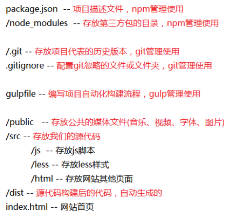

# 博学谷

## 附录

#### 参考github项目
- https://github.com/guopengfei116/boxuegu_11/

#### md文件转html
- 全局安装包
    + `npm i -g  i5ting_toc`
- 安装后进入你要转换的md文件所在目录，运行下面命令就自动转换了
    + `i5ting_toc -f xxx.md`

## 项目结构设计与操作
- 把之前写好的静态文件直接导入到项目中
- 通过npm创建如下目录
   + package.json: `npm init -y`
   + /node_modules: npm 安装包自动创建
- 通过git创建如下目录
   + /.git: `git init`
- 通过gulp创建如下目录
   + /dist: 当我们运行gulp任务的时候自动创建
- 然后手动创建如下目录
   + .gitignore
   + gulpfile.js
   + /public
       * /public/img
   + /src
       *  /src/js
       *  /src/less
       *  /src/html
   + index.html

#### 结构设计


#### 安装包
- 运行时依赖：
    + `npm install jquery@1 art-template bootstrap font-awesome`
- 开发时依赖：
    + `npm install gulp gulp-htmlmin gulp-concat gulp-clean-css gulp-less gulp-uglify gulp-rename browserify -D`

#### 调整/src/html目录
- 把home目录名修改为user

#### 调整/src/js目录
- 创建/src/js/category
    + 根据对应目录的html创建js
- 创建/src/js/course
    + 根据对应目录的html创建js
- 创建/src/js/teacher
    + 根据对应目录的html创建js
- 创建/src/js/user
    + 根据对应目录的html创建js
- 创建/src/js/common
- 创建/src/js/index.js
- 把common.js放置到/src/js/common目录下

#### 最终结构预览


## gulp构建流程编写

#### browserify打包CommonJS模块

- 安装包
    + `npm i browserify vinyl-source-stream vinyl-buffer -D`

- 编写一个打包任务
```javascript
// 打包CommonJS模块
gulp.task('js', function() {
    browserify('src/js/index.js').bundle() // 打包index.js
        .pipe(source('index.js'))
        .pipe(buffer())
        // .pipe(uglify())
        .pipe(gulp.dest('dist/js'));
});
```

- 编写测试脚本
```javascript
// src/common/a.js
module.exports = 123;
```
```javascript
// src/common/b.js
module.exports = {
	aa: 1111,
	bb: 2222,
	cc: 3333
};
```
```javascript
// src/js/index.js
var a = require('./a.js');
var b = require('./b.js');
console.log(a);
console.log(b);
```

- 浏览器环境测试
   + 运行：`gulp js`
   + 创建dist/js/test.html，引入构建生成的index.js
   + 打开浏览器看看页面的控制台有没有正确打印值

## 实现登陆功能

#### 引入jquery-form插件
- 安装
    + `npm i jquery-form`
- 在gulpfile中进行jsLibs的配置
    + 数组中添加`'node_modules/jquery-form/dist/jquery.form.min.js'`
- 运行gulp打包jsLab任务
    + `gulp jsLib`

#### html修改
- 修改form表单的action与method属性
    + action对应接口地址
    + method对应接口方法
- 修改input的name属性
    + name值对应接口字段名

#### js编写
```javascript
// 当用户点击登陆按钮的时候，这个插件ajaxForm方法会自动监听submit事件
// 然后阻止浏览器默认的刷新提交，然后自动变成ajax的方式发送请求。
$('#login-form').ajaxForm({
    success: function(data) {
        if(data.code == 200) {
            alert('登陆成功');
        }else {
            alert('登陆失败');
        }
    },
    error: function() {
        alert('登陆失败');
    }
});
```

## 首页退出功能

#### 实现公共的header部分js
- 创建src/js/common/header.js
```javascript
// 退出功能
$('#btn-logout').on('click', function() {
    $.ajax({
        url: '/v6/logout',
        type: 'post',
        success: function(data) {
            if(data.code == 200) {
                alert('退出成功');
                location.href = '/dist/html/user/login.html';
            }
        }
    });
});
```

#### 首页功能实现
- 在index.html中给退出按钮添加一个id为btn-logout
- 然后在src/js/index.js中导入公共的header.js
```javascript
// 首页需要头部功能，所以这里导入一下
require('./common/header.js');
```

## 抽取页面的公共部分，实现复用

#### 公共html抽取
- 创建/src/html/common目录
- 剪切index.html中的左侧导航html片段，放置到/src/html/common/aside.html
- 剪切index.html的头部html，放置到/src/html/common/header.html
- 剪切index.html的三个引入css的link标签，放置到/src/html/common/style.html

#### 安装gulp-html-replace插件
- `npm install gulp-html-replace -D`

#### 修改gulpfile.js
```javascript
var htmlReplace = require('gulp-html-replace');

// html处理
gulp.task('html', function() {
    gulp.src(['src/**/*.html', 'index.html'])
        .pipe(htmlReplace({
          style: gulp.src('src/html/common/style.html'),
          aside: gulp.src('src/html/common/aside.html'),
          header: gulp.src('src/html/common/header.html')
        }))
        .pipe(htmlmin({
            collapseWhitespace: true, // 去掉空白字符
            minifyJS: true,//压缩页面JS
            minifyCSS: true,//压缩页面CSS
            removeComments: true//清除HTML注释
        }))
        .pipe(gulp.dest('dist'));
});
```

#### 首页使用与测试
- 在index.html中把三个css样式进行替换
```html
<!-- build:style -->
<!-- endbuild -->
```
- 在index.html中把左侧导航html进行替换
```html
<!-- build:aside -->
<!-- endbuild -->
```
- 在index.html中把头部html进行替换
```html
<!-- build:header -->
<!-- endbuild -->
```

## 学生遇到的问题记录
- $未定位
    + gulpfile中的jsLib打包任务，务必保证第三方包的路径是正确的
    + 我们打包的后的文件在dist目录下，别写错
    + 页面中必须要先引入lib.js
- 浏览器报lib.js语法错误
    + 你可能不小心把jsLib中第三方包的文件写错了
    + 你可能把css样式也打包到lib.js中了
- 浏览器缓存问题
    + 解决办法就是调试工具network中的disable cache勾上
    + 勾上还不行，开发过程中时刻把你的调试工具打开
- 表单提交失败问题
    + 打开浏览器调试工具看看你的请求url、method以及发送的数据对不对，有没有缺失
    + 有问题的话，要么修改form表单，要么修改$.ajax方法中传递参数
- gulp任务不起作用
    + gulpfile文件修改后记得重新跑一下命令
- gulp-html-replace在页面中使用的位置
    + 在使用的时候，注释写到哪里，插件就会把对应的html片段插入到哪里
- 公共模版的抽取
    + 我们抽取的都是片段，将来插件会把片段插入到页面中
    + 所有这些片段中不要出现类似与meta、title这类的标签
- js效果没有实现
    + 先看看控制器有没有报错
    + 在看看js的引入有没有报错
    + 最后端点调试，先根据功能找到对应的实现代码，加断点调试，不行再一点点修正端点的位置进行调试
- form触发了默认的提交
    + 选择器写错了
    + 如果是手动监听的submit事件，可能是你没有阻止默认事件
- css文件报404
- gulp打包时说某某包为empty

## 左侧导航公共功能实现

#### 导航用户信息展示
- 要在/src/js/user/login.js中记录服务器返回的用户信息
```javascript
if(data.code == 200) {
    alert('登陆成功');
    localStorage.setItem('userinfo', JSON.stringify(data.result));
    location.href = '/dist';
}
```
- 在/src/js/common/aside.js中获取本地存储的用户信息，展示到页面中
```javascript
/**
 * 用户信息展示：
 * 1、读取storage的userinfo数据
 * 2、但是数据是字符串，使用不便，使用JSON.parse转为对象使用
 * 3、然后把对象中的名字与头像设置到导航对应的标签中
 * */
var userinfoStr = localStorage.getItem('userinfo');
var userinfo = JSON.parse(userinfoStr);
$('.aside img').attr('src', userinfo.tc_avatar);
$('.aside h4').text(userinfo.tc_name);
```

#### 点击标题子列表显示隐藏
- 在/src/js/common/aside.js中编写功能
```javascript
/**
 * 点击标题子列表显示隐藏：
 * 1、获取导航中a标签绑定点击事件
 * 2、事件触发时让它的下一个兄弟元素ul显示隐藏切换
 * */
$('.navs a').on('click', function() {
  $(this).next('ul').slideToggle();
});
```

#### 根据页面自动定位导航焦点，并展示父级元素
- 在/src/js/common/aside.js中编写功能
```javascript
/**
 * 根据访问的页面给对应的标题添加焦点：
 * 1、首先获取页面location.pathname
 * 2、获取全部的导航a标签，先统一取出active类名
 * 3、然后利用这个值和导航a标签的href去匹配得到对应的a标签，添加active类名焦点样式
 * 4、最后在焦点a标签的父级元素，让它show
 * */
var path = location.pathname;
$('.navs a').removeClass('active');
$('.navs a[href="' + path + '"]').addClass('active').parents('ul').show();
```

#### 测试
- 用户信息的展示通过首页测试就可以
- 导航下拉列表显示隐藏通过首页测试就可以
- 焦点位置除了首页测试，还的通过另外一个子级页面测试（我取的src/tacher/list.html）
    + list页面要替换公共的style、aside、header模版片段，引入lib.js与list.js脚本
	+ html页面替换完毕后，src/js/teacher/list.js中要导入公共的header、aside脚本

## 个人中心

#### 数据回显
- 修改/src/html/user/profile.html，抽取模版
- 修改/src/js/user/profile.js
```javascript
/**
 * 数据回显：
 * 1、请求接口获取当前用户的信息
 * 2、使用模版引擎把数据嵌套到模版当中，得到数据渲染后的模版
 * 基本语法：var html = template('id', data)
 * 3、把渲染后的模版插入到页面指定位置
 */
$.ajax({
    url: '/v6/teacher/profile',
    type: 'get',
    success: function(data) {
        if(data.code == 200) {
            $('.teacher-profile').html(template('teacher-profile-tpl', data.result));
        }
    }
});
```